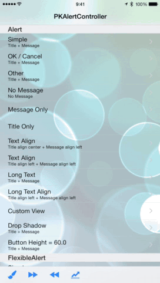

# PKAlertController

<!-- [](https://travis-ci.org/Satoshi Ohki/PKAlertController) -->
[](http://cocoadocs.org/docsets/PKAlertController)
[](http://cocoadocs.org/docsets/PKAlertController)
[](http://cocoadocs.org/docsets/PKAlertController)
[](https://www.versioneye.com/objective-c/pkalertcontroller/0.3.1)
[](https://www.versioneye.com/objective-c/pkalertcontroller/references)

PKAlertController is a flexible, highly customizable, many view transitional animation popup view controller.

## Screenshots





## Features

* `PKAlertController` has the title and description label, and you can set a text alignment.
* Made with UIViewController-based, so that you can call it as the modal view controller, or add it to some view controller.
* There are many cutom view controller transitions.
* There are some layout styles, and it is the style of the size about the same as a UIAlertview, the flexible size and the fullscreen size.
* To customize UI Color theme, use the class that inherited `PKAlertDefaultTheme`.
* The view content is customizable to set a custom view same as a titleView of UINavigationItem.

## Usage

To run the example project, clone the repo, and run `pod install` from the Example directory first.

## Requirements

* Supported build target - iOS 8.2 (Xcode 6.2, Apple LLVM compiler 6.0)
* supported deployment target - iOS 7.1

## Installation

PKAlertController is available through [CocoaPods](http://cocoapods.org). To install
it, simply add the following line to your Podfile:

    pod "PKAlertController"


## Components

* PKAlertViewController - The root view controller of an alert.
* PKAlertAction - This object represents an action that can be taken when tapping a button in an alert, and like a `UIAlertAction`.
* PKAlertControllerConfiguration - An object defines the behavior of an alert.
* PKAlertThemeManager - An object that manage the UI Color theme.

## Examples

### Import

Use by including the following import:

```objective-c
#import <PKAlertController.h>
```

### Getting started

```objective-c
// Import this library.
#import <PKAlertController.h>

// Instantiate and configure a simple alert view controller with ok button.
PKAlertViewController *alertViewController = [PKAlertViewController simpleAlertControllerWithConfigurationBlock:^(PKAlertControllerConfiguration *configuration) {
    configuration.title = @"Alert title";
    configuration.message = @"Alert message";
	configuration.preferredStyle = PKAlertControllerStyleAlert;
}];

// Call present view controller as modal view controller goes with custom view controller transitional animation.
[self presentViewController:alertController animated:YES completion:nil];
```

### Text alignment

To set the text alignment of title and message in a alert:

```objective-c
PKAlertViewController *alertViewConroller = [PKAlertViewController simpleAlertControllerWithConfigurationBlock:^(PKAlertControllerConfiguration *configuration) {
    configuration.title = @"Alert title";
    configuration.message = @"Alert message";
	configuration.titleTextAlignment = NSTextAlignmentLeft;
	configuration.messageTextAlignment = NSTextAlignmentLeft;
}];
```

### Action button

```objective-c

// Add common actions.
NSMutableArray *actions = [NSMutableArray array];
[actions addObject:[PKAlertAction cancelAction]];
[actions addObject:[PKAlertAction okActionWithHandler:^{
	NSLog(@"Tap the ok button!");
}]];
// Add a custom action.
[actions addObject:[PKAlertAction actionWithTitle:@"Close" handler:^{
	NSLog(@"Tap the close button!");
}]];

PKAlertViewController *alertViewConroller = [PKAlertViewController simpleAlertControllerWithConfigurationBlock:^(PKAlertControllerConfiguration *configuration) {
    configuration.message = @"Alert message";
	// Set to the alert configuration.
    [configuration addActions:actions];
}];
```

### Custom view

```objective-c
// Create a custom view
UINib *nib = [UINib nibWithNibName:NSStringFromClass([PKCustomView class]) bundle:[NSBundle mainBundle]];
PKCustomView *customView = [[nib instantiateWithOwner:nil options:nil] firstObject];

// Set the custom view
PKAlertViewController *alertViewConroller = [PKAlertViewController simpleAlertControllerWithConfigurationBlock:^(PKAlertControllerConfiguration *configuration) {
	configuration.customView = customView;
}];
```

And if you implement `PKAlertViewLayoutAdapter` in the custom view, will get an oppotunity to apply something to `PKAlertViewController` view components.

```objective-c
#pragma mark - <PKAlertViewLayoutAdapter>

- (void)applyLayoutWithAlertComponentViews:(NSDictionary *)views {
	// apply autolayouts to a PKAlertViewController's component.
	// contained views in views
	// key = `PKAlertRootViewKey`, value = PKAlertViewController's root view.
	// key = `PKAlertContentViewKey`, value = PKAlertViewController's content container view.
	// key = `PKAlertScrollViewKey`, value = PKAlertViewController's content scroll view.
	// key = `PKAlertTopLayoutGuideKey`, value = Top layout guide object.
	UIView *contentView = PKAlertGetViewInViews(PKAlertContentViewKey, views);

    NSMutableArray *contentConstraints = @[
        [NSLayoutConstraint constraintWithItem:self.headerImageView attribute:NSLayoutAttributeTop relatedBy:NSLayoutRelationLessThanOrEqual toItem:
         contentView attribute:NSLayoutAttributeTop multiplier:1 constant:0],
    ].mutableCopy;
    NSLayoutConstraint *constraint = [NSLayoutConstraint constraintWithItem:self.headerImageView attribute:NSLayoutAttributeTop relatedBy:NSLayoutRelationEqual toItem:contentView attribute:NSLayoutAttributeTop multiplier:1 constant:0];
    constraint.priority = UILayoutPriorityDefaultHigh;
    [contentConstraints addObject:constraint];
    [contentView addConstraints:contentConstraints];

}

- (void)visibleSizeInAlertView {
	// Adjust visible size in alert view.
	CGSize size = self.layoutSize;
	size.height -= 44;
	return size;
}
```

### PreferredStyle

The style of PKAlertViewControler. See the example project to use the style.

```objective-c
typedef NS_ENUM (NSInteger, PKAlertControllerStyle) {
    PKAlertControllerStyleAlert = 0,		// Normal style that the size about same as the size of UIAlertView.
    PKAlertControllerStyleFlexibleAlert,	// A style of flexible size.
    PKAlertControllerStyleFullScreen,		// A style of full screen.
};
```

If you use a style of full screen and push it to a navigation controller, Write the following code:

```objective-c
// Create a PKAlertViewController
PKAlertViewController *viewController = [PKAlertViewController instantiateOwnerViewController];

// Create a custom view
UINib *nib = [UINib nibWithNibName:NSStringFromClass([PKCustomView class]) bundle:[NSBundle mainBundle]];
PKCustomView *customView = [[nib instantiateWithOwner:nil options:nil] firstObject];

// Configure behavier
PKAlertControllerConfiguration *configuration = viewController.configuration;
configuration.customView = customView;
configuration.preferredStyle = PKAlertControllerStyleFullScreen;	// Set the full screen style.
configuration.statusBarAppearanceUpdate = NO;	// Prevent the status bar appearance updating.
viewController.view.frame = CGRectMake(0, 0, CGRectGetWidth(self.view.bounds), CGRectGetHeight(self.view.bounds));
viewController.title = @"Full screen style";

// Push alert to a navigation controller.
[self.navigationController pushViewController:viewController animated:YES];
```

### Custom view controller presenting/dismissing transition animation.

To use the animation style, the following code:

```objective-c
// Set the custom view
PKAlertViewController *alertViewConroller = [PKAlertViewController simpleAlertControllerWithConfigurationBlock:^(PKAlertControllerConfiguration *configuration) {
	// Set the presenting transition style
	configuration.presentationTransitionStyle = PKAlertControllerPresentationTransitionStyleScale;
	// Set the dismissing transition style
    configuration.dismissTransitionStyle = PKAlertControllerDismissStyleTransitionZoomOut;
}];
```

## PKAlertAction

The action button convenience constructor, one of the following:

```objective-c
+ (instancetype)actionWithTitle:(NSString *)title handler:(PKActionHandler)handler;
+ (instancetype)cancelAction;
+ (instancetype)cancelActionWithHandler:(void(^)(PKAlertAction *))handler;
+ (instancetype)okAction;
+ (instancetype)okActionWithHandler:(void(^)(PKAlertAction *))handler;
+ (instancetype)doneAction;
+ (instancetype)doneActionWithHandler:(void(^)(PKAlertAction *))handler;
```

## PKAlertViewController

The alert view controller convenience constructor, one of the following:

```objective-c
+ (instancetype)instantiateOwnerViewController;
+ (instancetype)alertControllerWithConfigurationBlock:(PKAlertControllerConfigurationBlock)configurationBlock;
+ (instancetype)simpleAlertControllerWithConfigurationBlock:(PKAlertControllerConfigurationBlock)configurationBlock;
+ (instancetype)alertControllerWithConfiguration:(PKAlertControllerConfiguration *)configuration;
```

If you like procedural wrinting:

```objective-c
PKAlertControllerConfiguration *configuration = [[PKAlertControllerConfiguration alloc] init];
configuration.message = @"Alert message";
configuration.actionControlHeight = 60;
[configuration addAction:[PKAlertAction cancelAction]];

PKAlertViewController *viewController = [PKAlertViewController alertControllerWithConfiguration:configuration];
```

Or the builder design pattern:

```objective-c
PKAlertViewController *viewController = [PKAlertViewController alertControllerWithConfigurationBlock:^(PKAlertControllerConfiguration *configuration) {
	configuration.message = @"Alert message";
	configuration.actionControlHeight = 60;
	[configuration addAction:[PKAlertAction cancelAction]];
}];
```

## Author

Satoshi Ohki, ohki@goodpatch.com

## License

PKAlertController is available under the MIT license. See the LICENSE file for more info.

